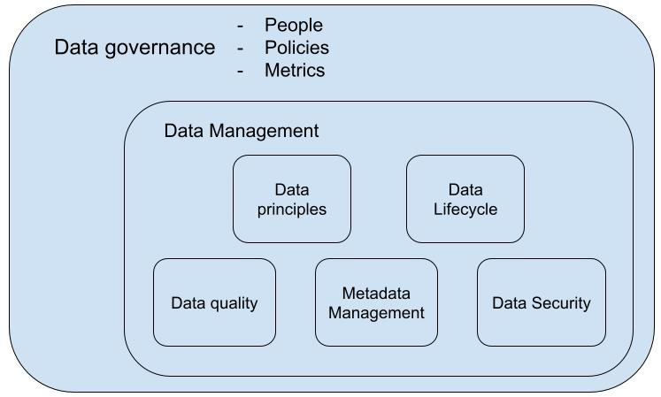

# Seminar data catalog

In this seminar, we will learn:
- What is data governance?
- What is metadata management? 
- What is a data catalog? 
- What are the popular data catalog implementations?
- How to use Open-Metadata(OM) as a data catalog?

## 1. What is data governance?

**Data governance is a collection of processes, roles, policies, standards, and metrics** that ensure the data
- availability, 
- usability/interoperability,
- security (i.e. confidentiality, integrity, privacy). 

It makes the use of data **consistent, trustworthy, effective and efficient.** 

**Data governance is a strategy, not a technology**. It consists of a set of decision-making process and rules which 
 govern data throughout their entire data life-cycle. It defines mainly three things:
- **People**: who have the right to make the decisions and accountable for them. For example, if someone asks to access data,
  who can decide whether we grant access to the user or not.
  
- **Policies**: what `decisions/rules` must be made to ensure effective management and use of data (decision domains). For example, 
  before publishing data, the data must pass the `quality control` and `privacy control`, etc.

- **Metrics**: how to `measure/evaluate` if `decisions/rules` are respected. For example, to control the `data quality`, we need 
  to define the `metrics for data accuracy, completeness, etc`.

### 1.1 What is data management

**Data management is an entire suite of practices, processes,  systems and tools which implement the data governance definitions**. 

The five elements of an integrated Data management framework:

- Data Principals: define governance.
- Data Lifecycle: tracks data’s journey.
- Data Quality: ensures usability.
- Metadata management: provides context of data.
- Data Security: protects data assets.

The Below figure shows a general representation of data governance and management

## 2. What is metadata management?

There are two main parts of metadata management:
 - Gathering and loading the metadata of essential data entities(e.g. file, table, data pipeline, etc.)
 - Use the metadata to search/discover, understand and trace data.

In this seminar, we use **OpenMetadata** as the metadata management tool. Because it covers all
the functionality that **Atlas** offers. For the functionalities which **Atlas** do not offer, I will
notify you. 

## 2.1 Use the metadata to search and discover data

### 2.1.1 Discover data with keywords

Suppose I am a newcomer, and all I know is that the data is about `hospital in french communes`. 

## 2.2 Use the lineage metadata to trace data provenance 

## 2.3 Collaboration (Atlas does not provide this functionality)

Announcements, tasks, Activity feed, and team conversations

## 2.4 Gathering metadata

## 2.5 Load metadata into OpenMetadata
## 3. What is a data catalog?

## 4. What are the popular data catalog implementations?

## 5. How to use Open-Metadata(OM) as a data catalog?

### 5.1 Load data entity

### 5.2 Load Glossary
### 5.3 Load Classification

### 5.4 Load data lineage

### 5.5 How to use the search engine

